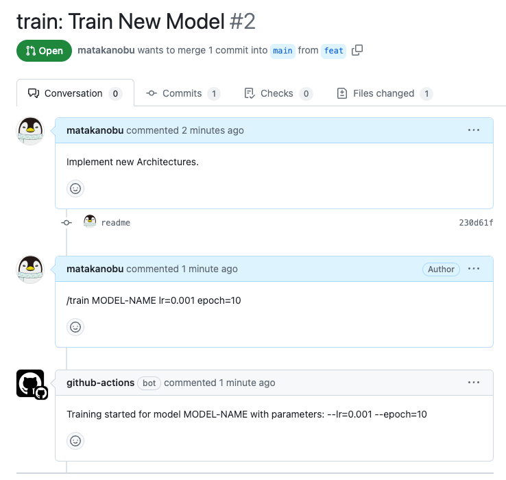

# Python Monorepo

This repository demonstrates a monorepo architecture using Poetry. It aims to manage multiple projects in a single
repository and shares common code between these projects.

## Key Concepts

- Dependencies are managed using a `pyproject.toml` file in each directory.
- Common code is packaged in the `shared` directory and referenced in each project.
- Common code is referenced using relative paths, and it's not packaged as a wheel.
- Development environment setup and deployment image building processes are managed using a Makefile and a Dockerfile.
- Local package dependencies are handled without the use of scripts as much as possible. Instead, those processes are
  described in the Makefile and Dockerfile.
- Each project has its own GitHub Actions workflow(CI) file.
- Training ML Models in the CI/CD Pipeline.

## Use Cases

This monorepo is intended to serve the following use cases:

- Manage dependencies with Poetry.
- Manage multiple projects in a single repository.
- Share common code that is not dependent on a specific project.
- Deploy each project as a Docker image.
- Develop using a Devcontainer also.
- Train ML Models triggered by Pull Requests.

## Directory Structure

Here's a breakdown of the top-level items in our directory structure:

- `projects`: This directory houses each individual project.
- `shared`: This is where the common code shared across multiple projects is located.
- `pyproject.toml`: This is the root configuration file where development tools like linters and formatters such as
  Flake8 and Black are specified.
- `.github/workflows`: This directory contains the GitHub Actions workflows for each project. Each project has its own
  workflow file.

The structure is as follows:

```
python-monorepo
├── .flake8
├── .gitignore
├── .github
│   └── workflows
│       └── project-a.yml
├── README.md
├── poetry.lock
├── pyproject.toml
├── projects
│   ├── project-a
│   │   ├── .devcontainer
│   │   │   ├── Dockerfile
│   │   │   └── devcontainer.json
│   │   ├── Dockerfile
│   │   ├── Makefile
│   │   ├── poetry.lock
│   │   ├── pyproject.toml
│   │   ├── run.py
│   │   ├── src
│   │   │   ├── __init__.py
│   │   │   └── pipeline.py
│   │   └── tests
│   │       ├── __init__.py
│   │       └── test_pipeline.py
│   └── project-b
│       ├── src
│       │   └── __init__.py
│       └── tests
│           └── __init__.py
└── shared
    ├── pkg1
    │   ├── __pycache__
    │   ├── pkg1
    │   │   ├── __init__.py
    │   │   └── base_pipeline.py
    │   ├── poetry.lock
    │   └── pyproject.toml
    └── pkg2
        ├── pkg2
        │   ├── __init__.py
        │   └── calc.py
        ├── poetry.lock
        └── pyproject.toml
```

## Adding Local Packages

To add local packages to your project, add them to the `pyproject.toml` file:

```bash
cd projects/project-xxx
poetry add ../../shared/pkg-yyy/
```

Add the copied shared package to the Makefile:

```bash
# Copy the shared package written in pyproject.toml
cp -r ../../shared/pkg-yyy $(TMP_DIR)/pkg-yyy
```

And also add the package to the Dockerfile:

```bash
# Copy the shared package written in pyproject.toml
COPY ./pkg-yyy/ /shared/pkg-yyy/
```

## How to Use

### Development

For setting up a development environment, navigate to the desired project directory and run `make dep`.

```bash
cd projects/project-xxx
make dep
```

Alternatively, you could use a Devcontainer.

### Deployment

For deployment, navigate to the project directory and run `make build`.

```bash
cd projects/project-xxx
make build
```

## Testing

To run tests, use the following command:

```bash
cd projects/project1-xxx
poetry run python -m pytest
```

Alternatively, you can run tests inside a Docker container:

```bash
cd projects/project1-xxx
make test
```

## CI (Continuous Integration)

In Continuous Integration (CI), it is crucial to run code tests at the time of Pull Request creation and when merging
into the main branch.

Here, we use "make build" and "make test" to perform builds and tests. Workflows are created on a per-project basis, and
builds and tests are conducted only for projects with changes in their respective src directories. This approach
eliminates the need to run build/test for every project every time, significantly saving time. Moreover, by
standardizing the command interface for build and test across projects using Makefile, the description of the workflow
becomes very simple.

## Model Training with CI/CD

In the CI/CD pipeline, we can train ML models triggered by Pull Request comments.
The comment would work as a command, and take hyperparameters as an argument.

It would be like this:



This is useful for training models in a reproducible manner and for sharing the results with team members.